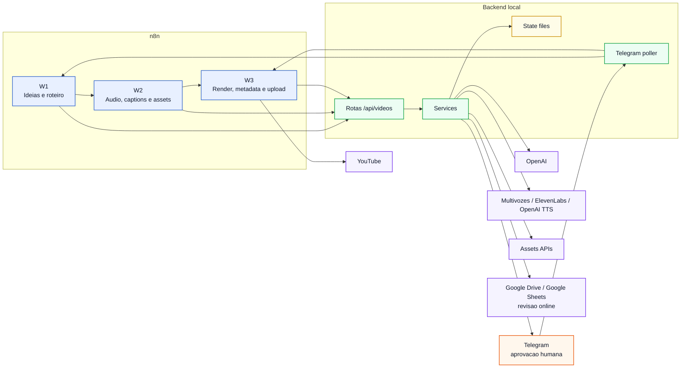
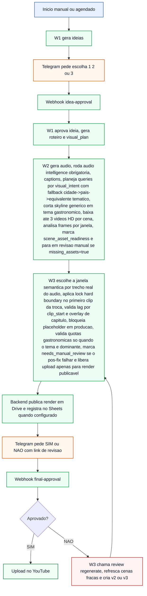

# Fluxo Visual do Pipeline

Este arquivo e a visao rapida do pipeline. Para a versao completa e detalhada, veja fluxo.md.

Se quiser uma visualizacao mais grafica, abra fluxo-visual.html.

## Mapa Geral



## Sequencia Resumida



## Quem faz o que

| Bloco | Responsabilidade |
| --- | --- |
| n8n | Orquestra a ordem do processo e os webhooks |
| Backend local | Executa ideias, roteiro com visual_plan, planner narrativo por blocos, visual_intent por cena, audio, audio intelligence e chapter triggers, busca video-first com ate 3 assets por cena, query planner tematico com fallback cidade->pais->equivalente, rejeicao previa de assets genericos, analise visual por janela, scene_asset_readiness, score composto da timeline, lock hard boundary no primeiro clip da troca, overlays de capitulo, QA tecnico/semantico deterministico por boundary com max_visual_lag_sec, bloqueio de placeholder em producao, needs_manual_review por missing_assets no W2 ou apos falha no pos-fix, upload so com render publicavel e hard_boundary_status=pass |
| Telegram | Recebe aprovacao da ideia, aprovacao final e status intermediarios |
| Google Drive / Sheets | Hospeda a revisao online e registra o link do render |
| Estado local | Guarda status, visual_plan, render_timeline, arquivos e ids de mensagens |

## Entradas Atuais

```text
Manual Trigger -> iniciar video sob demanda
Schedule Trigger -> iniciar video automaticamente toda segunda-feira as 09:00
Webhook idea-approval -> continuar apos resposta 1/2/3
Webhook final-approval -> continuar apos resposta SIM/NAO
```

## Status que chegam no Telegram

```text
Automacao iniciada
Roteiro gerado
Audio gerado
Legendas geradas
Assets preparados
Render gerado
Revisao final pronta com link online quando configurado

Cada status intermediario sai uma unica vez por video_id e a revisao final sai uma unica vez por versao do draft.
Upload concluido
Revisao solicitada -> nova versao do draft
```

O render final nao queima legendas. O W2 gera SRT/VTT sidecar, salva ate 3 videos HD por cena, usa visual_intent para montar queries mais especificas, rejeita skyline, paisagem e cidade generica quando a cena pede comida, extrai frames representativos por janela e usa OpenAI vision ou provider local para descrever o que cada trecho do video realmente mostra quando configurado. Agora o assetsService persiste scene_asset_readiness por cena e marca asset_failure quando so existe placeholder local em producao, e o Workflow 2 so chama o W3 quando missing_assets=false; se faltar asset real, ele marca needs_manual_review antes do render. O W3 recorta subclips de 3 a 10 segundos, separa a janela de exibicao da janela semantica do roteiro, ancora a entrada real de cada cena no trecho certo do script, cria blocos neutros de intro/outro quando o texto fica generico demais para uma cena tematica, escolhe a janela do asset de cada corte com score semantico usando query, metadados do provider, visual_intent_match, required_visual_evidence e analysis_windows do video, grava clip_script_excerpt, asset_window_summary, semantic_match_score, visual_intent, detected_visual_categories e query_used no render_timeline para revalidacao, aplica lock de hard boundary no primeiro clip da troca e mede lag por clip_start. O QA do W3 exige hard_boundary_status=pass, max_visual_lag_sec no limite e chapter overlay nas trocas hard obrigatorias para liberar metadata/upload. As quotas gastronomicas do QA so entram quando o tema declarado do video ou a dominancia real das cenas e clipes e gastronomica; uma mencao isolada a comida em video geral de viagem nao ativa esse bloqueio. Se a resposta final for NAO, o backend usa esse render_timeline para localizar cenas com baixo score, mismatch tematico, excesso de cidade generica ou reuso pesado, rebusca so essas cenas e preserva o restante do draft antes da nova versao.

## Onde abrir primeiro

```text
Visao completa do fluxo: fluxo.md
Workflow 1: pipeline/n8n/workflow1_weekly_topic_script.json
Workflow 2: pipeline/n8n/workflow2_audio_captions_assets.json
Workflow 3: pipeline/n8n/workflow3_render_youtube.json
Telegram replies: pipeline/src/services/telegramApprovalService.js
Review online: pipeline/src/services/reviewPublishingService.js
Regeneracao de revisao: pipeline/src/services/reviewRevisionService.js
Visual plan: pipeline/src/utils/visualPlan.js
Busca de assets HD: pipeline/src/services/assetsService.js
Visual intent e categorias proibidas: pipeline/src/services/visualIntentService.js
Render timeline: pipeline/src/services/renderService.js
QA tematico e fix sync: pipeline/src/services/syncValidator.js
Providers de voz: pipeline/src/services/ttsService.js
OpenAI: pipeline/src/services/openaiService.js
```
