# Fluxo do Pipeline de Videos

Versao resumida e mais visual:

- ver fluxo-visual.md
- ver fluxo-visual.html

## Visao Geral

Este documento descreve o fluxo real do pipeline entre n8n, backend local e APIs externas.

- O n8n orquestra a ordem das etapas.
- O backend local executa a logica de negocio e salva o estado.
- O Telegram faz a aprovacao humana em dois pontos e agora tambem recebe status intermediarios do pipeline.
- Cada status intermediario e cada mensagem final de revisao sao deduplicados por video_id e versao do draft para evitar poluicao no chat.
- Google Drive e Google Sheets podem receber o render de revisao e o link online quando configurados.
- As APIs externas geram ideias, roteiro, audio, ajudam nas legendas sidecar e recebem o upload final.

## Componentes

| Componente | Papel no fluxo | Arquivos principais |
| --- | --- | --- |
| n8n Workflow 1 | Inicio manual/agendado, geracao de ideias, aprovacao da ideia, roteiro com visual_plan, chamada do W2 | pipeline/n8n/workflow1_weekly_topic_script.json |
| n8n Workflow 2 | Audio, audio intelligence obrigatoria, legendas SRT/VTT, busca video-first de assets HD por cena com query planner por visual intent e fallback cidade->pais->equivalente tematico, rejeicao previa de assets genericos, analise visual por janela, scene_asset_readiness para bloquear cenas sem asset real em producao e gate explicito antes do W3; quando missing_assets=true marca needs_manual_review e nao segue para render | pipeline/n8n/workflow2_audio_captions_assets.json |
| n8n Workflow 3 | Render multi-clip por janelas semanticas de video, lock editorial de hard boundary (primeiro clip da troca obrigatoriamente do novo bloco), QA tecnico + semantico deterministico por boundary com lag maximo, gate de metadata/upload por hard_boundary_status=pass e max_visual_lag_sec dentro do limite, fix sync seletivo, needs_manual_review apos falha no pos-fix, metadata, aprovacao final, upload | pipeline/n8n/workflow3_render_youtube.json |
| Backend local | Executa todas as operacoes reais via rotas e services | pipeline/src/routes/videoRoutes.js |
| Audio Intelligence | Timestamps word-level do audio via OpenAI Whisper ou fallback, deteccao de pausas e boundaries sugeridas | pipeline/src/services/audioIntelligence.js |
| Narrative Block Planner | Agrupa roteiro e visual_plan em macroblocos e microblocos com keywords, visual_intent, evidencias obrigatorias, chapter_trigger e contrato de transicao (boundary_id, expected_location, expected_visual_start_sec, chapter_card_required, block_intro_asset) | pipeline/src/services/narrativeBlockPlanner.js |
| Visual Intent Layer | Detecta intencao visual da cena, categorias detectadas no asset e mismatch tematico | pipeline/src/services/visualIntentService.js |
| Semantic Matcher | Matching semantico via embeddings OpenAI entre narracao e janelas de video | pipeline/src/services/semanticMatcher.js |
| Timeline Planner V2 | Planeja timeline usando texto real do audio por intervalo, aplica lock do primeiro clip em hard boundary, impede crossing de bloco, proibe neutral_fallback no primeiro slot hard e mede lag de transicao por clip_start | pipeline/src/services/timelinePlanner.js |
| Sync Validator | Valida sincronia, diversidade, black frames, silencio, aplica QA deterministico por hard boundary (status pass/fail, max_visual_lag_sec, chapter overlay) e quotas gastronomicas so para tema declarado ou dominante | pipeline/src/services/syncValidator.js |

## Fluxo Visual

```mermaid
flowchart TD
    A1[Manual Trigger no n8n] --> B[Generate Ideas]
    A2[Schedule Trigger no n8n] --> B

    B --> C[POST /api/videos/ideas/generate no backend]
    C --> D[ideasService]
    D --> E[openaiService gera 3 ideias via OpenAI ou fallback mock]
    D --> F[Estado salvo como ideas_generated]
    D --> G[Mensagem enviada ao Telegram]

    G --> H[Usuario responde 1 2 ou 3 no Telegram]
    H --> I[telegramApprovalService recebe update]
    I --> J[POST /webhook/idea-approval no n8n]

    J --> K[Approve Idea no Workflow 1]
    K --> L[POST /api/videos/ideas/approve]
    L --> M[Estado salvo como idea_approved]
    M --> N[Generate Script no Workflow 1]
    N --> O[POST /api/videos/script/generate]
    O --> P[scriptService]
    P --> Q[openaiService gera roteiro ou fallback mock]
    Q --> Q1[buildVisualPlan gera cenas por bloco narrativo e keywords por entidade]
    Q1 --> R[Estado salvo como script_generated]
    R --> S[Call Workflow 2]

    S --> T[Workflow 2 Start]
    T --> U[Generate Audio]
    U --> V[POST /api/videos/audio/generate]
    V --> W[ttsService]
    W --> X[API Multivozes BR]
    W -. fallback .-> X2[OpenAI TTS]
    U --> U0[Analyze Audio Intelligence]
    U0 --> U01[POST /api/videos/audio/intelligence]
    U01 --> U1[Generate Captions]
    U1 --> U2[POST /api/videos/captions/generate]
    U2 --> U3[captionsService gera SRT e VTT]
    U3 --> AC[Search Assets]
    AC --> AD[POST /api/videos/assets/search]
    AD --> AE[assetsService]
    AE --> AF[busca por cena em Pexels Pixabay com filtro HD horizontal]
    AF --> AF0[assetQueryPlanner gera queries por visual_intent e assetRejectionService corta skyline paisagem e cidade generica quando a cena pede comida]
    AF0 --> AF1[extrai frames por janela e descreve o video com OpenAI vision ou provider local]
    AF1 --> AF2[scene_asset_readiness marca cenas sem asset real e asset_failure em producao]
    AF2 --> AF3{Assets prontos?}
    AF3 -->|sim| AG[Call Workflow 3]
    AF3 -->|nao| AF4[POST /api/videos/review/mark-manual-review e encerra o fluxo normal]

    AG --> AH[Workflow 3 Start]
    AH --> AI[Render Video]
    AI --> AJ[POST /api/videos/render]
    AJ --> AK[renderService]
    AK --> AK1[timeline multi clip por bloco narrativo com lock hard boundary, texto real do audio e visual_intent_match]
    AK1 --> AK2[Validate Render Sync e Quality com QA deterministico por boundary, lag maximo e mismatch tematico]
    AK2 --> AK3[Fix Sync seletivo por scene_index com reason especifica]
    AK2 --> AK4[Se o pos-fix ainda falhar, marca needs_manual_review e para o fluxo normal]
    AK1 --> AL[Generate Metadata apenas quando hard_boundary_status=pass e max_visual_lag_sec <= limite]
    AL --> AM[POST /api/videos/metadata/generate]
    AM --> AN[metadataService]
    AN --> AO[openaiService gera titulo descricao tags]
    AN --> AP[reviewPublishingService publica o render em Drive e registra no Sheets]
    AP --> AQ[Mensagem final no Telegram com links de revisao]

    AQ --> AR[Usuario responde SIM ou NAO]
    AR --> AS[telegramApprovalService recebe update]
    AS --> AT[POST /webhook/final-approval no n8n]
    AT --> AU[Save Approval]
    AU --> AV[POST /api/videos/final/approve]
    AV --> AW[Estado salvo como final_approved ou needs_revision]
    AW --> AX{If Approved}
    AX -->|true| AY[Upload to YouTube]
    AY --> AZ[POST /api/videos/youtube/upload]
    AZ --> BA[youtubeService sobe video apenas se approved e render_validation.is_publishable forem verdadeiros]
    BA --> BB[Video publicado no YouTube]
    AX -->|false| BC[POST /api/videos/review/regenerate]
    BC --> BD[reviewRevisionService incrementa versao do draft]
    BD --> BE[seleciona cenas com baixo score ou reuso pesado]
    BE --> BF[assetsService rebusca so essas cenas e preserva o restante]
    BF --> BG[render v2 v3 replanejam timeline e regeneram metadata]
    BG --> AI
```

## Fluxo Passo a Passo

### 1. Inicio do fluxo

O Workflow 1 tem dois gatilhos de entrada:

- Manual Trigger: usado quando voce quer iniciar um video manualmente no n8n.
- Schedule Trigger: usado quando voce quer disparar o mesmo fluxo de forma automatica.

Configuracao atual do agendamento no Workflow 1:

- toda segunda-feira
- 09:00

Arquivo:

- pipeline/n8n/workflow1_weekly_topic_script.json

### 2. Geracao das ideias

O no Generate Ideas do Workflow 1 chama a rota do backend:

- POST /api/videos/ideas/generate

Arquivo da rota:

- pipeline/src/routes/videoRoutes.js

Servico real:

- pipeline/src/services/ideasService.js

O ideasService:

- pede 3 ideias ao OpenAI via pipeline/src/services/openaiService.js
- usa fallback mock se OpenAI nao responder
- salva o estado como ideas_generated
- envia um status no Telegram avisando que a automacao foi iniciada
- envia a mensagem de aprovacao para o Telegram via pipeline/src/services/telegramService.js

### 3. Resposta no Telegram e retorno ao n8n

Quando voce responde 1, 2 ou 3:

- o backend local recebe isso no poller Telegram
- o poller localiza o video pela mensagem respondida
- ele chama o webhook do Workflow 1 no n8n

Arquivo responsavel:

- pipeline/src/services/telegramApprovalService.js

Webhook do n8n:

- idea-approval

### 4. Aprovacao da ideia e roteiro

O ramo de webhook do Workflow 1 executa:

- Approve Idea
- Generate Script
- Call Workflow 2

Rotas chamadas no backend:

- POST /api/videos/ideas/approve
- POST /api/videos/script/generate

Servico de roteiro:

- pipeline/src/services/scriptService.js

O scriptService:

- usa pipeline/src/services/openaiService.js para gerar o pacote do roteiro
- salva script_text, outline, pesquisa e SEO no estado
- gera visual_plan com cenas por heading, outline ou paragrafo, com titulos narrativos, entidades do proprio texto e duracao alvo por cena
- gera um arquivo markdown local do roteiro
- envia um status no Telegram avisando que o roteiro foi concluido e que o W2 vai iniciar

### 5. Workflow 2: audio, legendas e assets

O Workflow 2 comeca em um Execute Workflow Trigger e roda:

- Generate Audio
- Generate Captions
- Search Assets
- If Assets Ready
- Call Workflow 3 somente quando missing_assets=false
- Mark Needs Manual Review Missing Assets quando missing_assets=true

Arquivo:

- pipeline/n8n/workflow2_audio_captions_assets.json

Regra estrutural atual do W2:

- se Search Assets retornar missing_assets=false, o workflow segue para o W3
- se Search Assets retornar missing_assets=true, o W2 chama /api/videos/review/mark-manual-review com as blocking_scene_indexes e para o fluxo normal antes do render

#### Audio

Rota:

- POST /api/videos/audio/generate

Servico:

- pipeline/src/services/ttsService.js

Ordem atual de providers no servico:

- principal: Multivozes BR
- alternativo opcional: ElevenLabs
- fallback: OpenAI TTS
- fallback final: mock audio

Status enviados no Telegram durante o W2:

- audio gerado
- legendas geradas
- assets preparados

Regra atual do Telegram:

- cada status intermediario e enviado uma unica vez por video_id
- a revisao final e enviada uma unica vez por versao do draft

Se voce quiser trocar o provider principal de voz no futuro, o ponto principal de ajuste e:

- pipeline/src/services/ttsService.js

#### Legendas sidecar

Rota:

- POST /api/videos/captions/generate

Servico:

- pipeline/src/services/captionsService.js

Esse servico:

- gera subtitles.srt e subtitles.vtt a partir do audio e do roteiro
- usa transcricao via OpenAI quando disponivel e fallback local quando necessario
- salva os caminhos no state.json para uso posterior no upload
- nao queima legenda no MP4 final

#### Assets

Rota:

- POST /api/videos/assets/search

Servico:

- pipeline/src/services/assetsService.js

APIs usadas hoje:

- principal para busca visual: Pexels e Pixabay
- placeholder local: permitido apenas em mock/debug com ALLOW_PLACEHOLDER_ASSETS=true; em producao a cena fica bloqueada se nao houver asset real

Comportamento atual da busca de assets:

- usa visual_plan salvo no state para buscar assets por cena
- gera ate 4 queries por cena com base em keywords, entidades geograficas e visual_intent de cada bloco narrativo
- expande fallback de busca em ordem cidade -> pais -> equivalente tematico do intent quando a primeira rodada especifica nao basta
- tenta fechar cada cena com ate 3 videos externos longos antes de aceitar imagem
- aceita apenas assets em landscape com HD minimo 1280x720
- prioriza Full HD 1920x1080 ou maior quando disponivel
- para cenas de gastronomia, mercado, vinho, pastelaria, restaurante ou cafe, remove queries genericas de skyline travel e aerial city e amplia o pool de candidatos especificos
- persiste assets_json.scene_asset_readiness por cena e marca asset_failure/failure_reason quando nao existe asset visual real publicavel
- com MOCK_MODE=false e ALLOW_PLACEHOLDER_ASSETS=false, nao cria placeholder local para mascarar sucesso; o render deve parar antes da timeline
- antes do download, aplica score e rejeicao previa para cortar assets de cidade errada, paisagem bonita sem comida, janela generica longa demais e categorias proibidas para a cena
- apos baixar cada video, extrai de 1 a 3 frames representativos em janelas internas do proprio asset
- usa OpenAI vision ou provider local para gerar analysis_summary, analysis_tags e analysis_windows por video quando configurado
- enriquece cada janela com detected_visual_categories, visual_intent_match, generic_visual, required_evidence_found e missing_required_visual_evidence
- salva scene_index, resolucao, provider, duration_estimate, query_used e a analise visual por janela em assets_json.items

Arquivos principais que controlam essa etapa:

- pipeline/src/utils/visualPlan.js
- pipeline/src/services/assetsService.js
- pipeline/src/utils/mediaUtils.js

### 6. Workflow 3: render, metadata e publicacao

O Workflow 3 roda:

- Render Video
- Validate Render Sync
- Fix Render Sync quando necessario
- Mark Needs Manual Review quando o pos-fix continua ruim
- Generate Metadata
- Final Approval Webhook
- Save Approval
- If Approved
- Upload to YouTube

No fluxo atual, o render final nao queima legendas no video. O W2 gera arquivos SRT/VTT sidecar e o upload do YouTube tenta anexar essa trilha ao player.

Arquivo:

- pipeline/n8n/workflow3_render_youtube.json

#### Render

Rota:

- POST /api/videos/render

Servico:

- pipeline/src/services/renderService.js

Comportamento atual do render:

- monta uma timeline com varios clips em vez de loopar um unico asset
- usa o visual_plan para distribuir duracao por cena, separa a janela de exibicao da janela semantica do roteiro, ancora a entrada real de cada cena no trecho correspondente do script e cria blocos neutros de intro/outro quando o texto tem trechos genericos sem uma cena tematica clara
- em cada hard boundary, trava o primeiro clip no novo bloco narrativo, proibe neutral_fallback no primeiro slot hard e exige location valida quando a transicao e de cidade
- calcula lag visual de troca por clip_start e nao por clip_end, com limite configuravel via HARD_BOUNDARY_MAX_LAG_SEC
- valida crossing de boundary como falha estrutural (um clip nao pode atravessar a fronteira hard)
- tenta manter cada clip entre 3 e 10 segundos
- usa o audio narrado como trilha principal e limita a duracao final ao audio
- recorta subclips reais dos videos baixados em vez de repetir sempre o inicio do arquivo
- escolhe a janela do asset de cada corte com score semantico por trecho de roteiro, match de visual_intent, required_visual_evidence, categorias proibidas, genericidade e anti-repeticao, usando query, metadados do provider e analysis_windows geradas sobre frames reais do video
- grava clip_script_excerpt, asset_semantic_text, asset_window_summary, asset_window_start_seconds, asset_window_end_seconds, semantic_match_score, visual_intent, detected_visual_categories, visual_intent_match e query_used no render_timeline para revalidacao
- tenta aplicar xfade entre clips e cai para concat simples se o xfade falhar
- para imagens usa zoompan apenas como fallback duro; o caminho principal agora e video-first por cena
- bloqueia a timeline quando assets_json.scene_asset_readiness indicar cena sem asset publicavel em producao
- desabilita fallback visual local de segmento e fallback final de composicao quando ALLOW_PLACEHOLDER_ASSETS=false
- o QA final bloqueia publicacao quando um video gastronomico declarado ou dominantemente gastronomico fica subrepresentado em comida mercado vinho restaurante ou cafe, ou quando cidade generica paisagem e skyline passam do limite permitido
- o QA final agora tambem bloqueia publicacao quando hard_boundary_status != pass, quando max_visual_lag_sec excede o limite e quando falta chapter overlay em trocas hard obrigatorias
- uma cena isolada de comida dentro de um video geral de viagem nao ativa sozinha essas quotas gastronomicas
- salva render_timeline no state com clips, resolucao final, quantidade de cortes, distribuicao visual e estrategia usada

#### Metadata

Rota:

- POST /api/videos/metadata/generate

Servico:

- pipeline/src/services/metadataService.js

Esse servico:

- gera titulo, descricao, tags e chapters
- usa OpenAI quando disponivel
- tenta publicar o render no Google Drive e registrar a revisao no Google Sheets quando configurado
- envia a mensagem final para o Telegram com link online de revisao e link da planilha quando disponiveis

Servico da publicacao online:

- pipeline/src/services/reviewPublishingService.js

Configuracao opcional via ambiente:

- GOOGLE_CLIENT_ID, GOOGLE_CLIENT_SECRET, GOOGLE_REFRESH_TOKEN
- ou GOOGLE_SERVICE_ACCOUNT_EMAIL, GOOGLE_SERVICE_ACCOUNT_PRIVATE_KEY
- REVIEW_DRIVE_FOLDER_ID
- REVIEW_SPREADSHEET_ID
- REVIEW_SHEET_NAME

#### Aprovacao final

Quando voce responde SIM ou NAO:

- o backend local recebe a resposta
- chama o webhook final-approval do Workflow 3
- o Workflow 3 salva a aprovacao e decide se faz upload ou se gera uma nova versao do draft
- se o render continuar ruim depois do fix sync, o Workflow 3 agora marca needs_manual_review e nao segue para metadata com warning

Rotas envolvidas:

- POST /api/videos/final/approve
- POST /api/videos/review/regenerate
- POST /api/videos/youtube/upload

Servico do upload:

- pipeline/src/services/youtubeService.js

No upload atual para o YouTube, o backend:

- exige approved=true e render_validation.is_publishable=true, com needs_regeneration=false e needs_manual_review=false
- exige render_validation.hard_boundary_status=pass e render_validation.max_visual_lag_sec <= HARD_BOUNDARY_MAX_LAG_SEC
- sobe o MP4 final
- tenta anexar a legenda SRT/VTT gerada no W2 como trilha sidecar no player
- depende de YOUTUBE_REFRESH_TOKEN com escopo youtube.force-ssl ou youtubepartner para captions.insert
- permite ajustar idioma e nome da trilha via YOUTUBE_CAPTION_LANGUAGE e YOUTUBE_CAPTION_NAME

Helper para renovar o token com o escopo correto:

- yarn auth:youtube:url
- yarn auth:youtube:exchange <authorization_code>

Quando a resposta final e NAO:

- o Workflow 3 chama POST /api/videos/review/regenerate
- o backend incrementa a versao do draft
- o roteiro, audio e captions sao reaproveitados
- o backend analisa semantic_match_score, visual_intent_match, categorias detectadas, excesso de cidade generica em temas gastronomicos dominantes, reuso de asset e reuso de janela no render_timeline para escolher as cenas mais fracas
- o assetsService rebusca apenas essas cenas e tenta evitar os mesmos source_urls ja usados nelas, preservando o restante do pool
- o render gera uma nova timeline v2 ou v3 variando ordem, janela semantica e offset dos assets, agora com pool renovado nas cenas selecionadas e refreshReason como theme_visual_mismatch, visual_intent_underrepresented, generic_asset_overuse ou wrong_visual_category
- metadata e revisao final sao geradas de novo
- um novo link de revisao e uma nova mensagem de aprovacao sao enviados ao Telegram

## O que esta no n8n e o que esta no projeto local

### O que o n8n faz

- define a ordem do processo
- conecta W1 -> W2 -> W3
- expone os webhooks de aprovacao
- oferece start manual e start agendado
- quando a resposta final e NAO, chama a rota de regeneracao para criar uma nova versao do draft

### O que o projeto local faz

- gera ideias
- gera roteiro
- gera audio
- gera legendas sidecar SRT/VTT
- busca assets e faz refresh seletivo de cenas fracas na revisao
- persiste scene_asset_readiness e bloqueia render quando so houver placeholder local em producao
- analisa frames dos assets por janela e detecta categorias visuais reais
- aplica visual_intent por cena para orientar query, rejeicao e score final
- aplica contrato hard boundary por bloco com boundary_id, expected_location, chapter_trigger e block_intro_asset
- renderiza o video
- gera metadata
- envia mensagens para o Telegram
- envia status de progresso para o Telegram
- recebe respostas do Telegram
- salva estado e arquivos
- publica o render de revisao em Drive/Sheets quando configurado
- faz upload para o YouTube e tenta anexar a trilha sidecar
- bloqueia upload quando o QA nao marcar o render como publicavel
- bloqueia metadata/upload quando o gate de hard boundary reprovar
- marca needs_manual_review quando o W2 detecta missing_assets ou quando o pos-fix do QA falha, sempre parando o caminho normal antes da publicacao
- bloqueia videos gastronomicos quando a distribuicao visual fica generica demais

## Onde alterar cada parte no futuro

| O que voce quer trocar | Onde ajustar primeiro |
| --- | --- |
| Modelo da OpenAI para ideias | pipeline/src/services/openaiService.js |
| Modelo da OpenAI para roteiro | pipeline/src/services/openaiService.js |
| Titulo descricao tags | pipeline/src/services/openaiService.js e pipeline/src/services/metadataService.js |
| Provider de voz principal | pipeline/src/services/ttsService.js |
| Segmentacao visual por cena | pipeline/src/utils/visualPlan.js e pipeline/src/services/scriptService.js |
| Visual intent, evidencias obrigatorias e categorias proibidas | pipeline/src/services/visualIntentService.js e pipeline/src/services/narrativeBlockPlanner.js |
| Busca de assets HD por cena, readiness por cena e refresh seletivo | pipeline/src/services/assetsService.js, pipeline/src/services/assetReadinessService.js, pipeline/src/services/assetQueryPlanner.js e pipeline/src/services/assetRejectionService.js |
| Marcacao de revisao manual por assets ausentes no W2 ou falha no pos-fix do W3 | pipeline/src/services/manualReviewService.js, pipeline/n8n/workflow2_audio_captions_assets.json e pipeline/n8n/workflow3_render_youtube.json |
| Analise visual por frames e janelas | pipeline/src/services/assetsService.js, pipeline/src/services/localVideoUnderstandingService.js, pipeline/src/services/openaiService.js e pipeline/src/utils/mediaUtils.js |
| Timeline multi-clip, score e transicoes | pipeline/src/services/timelinePlanner.js, pipeline/src/services/timelineScoringService.js, pipeline/src/services/renderService.js e pipeline/src/utils/mediaUtils.js |
| QA semantico, hard boundary deterministico, quotas gastronomicas e fix sync seletivo | pipeline/src/services/syncValidator.js |
| Contrato de hard boundary por bloco e chapter triggers | pipeline/src/services/narrativeBlockPlanner.js e pipeline/src/services/audioIntelligence.js |
| Limites e politicas de hard boundary (env) | pipeline/src/config/env.js e pipeline/.env.example |
| Legenda sidecar do YouTube | pipeline/src/services/captionsService.js e pipeline/src/services/youtubeService.js |
| Status enviados no Telegram | pipeline/src/services/telegramService.js |
| Publicacao da revisao online | pipeline/src/services/reviewPublishingService.js |
| Logica de regeneracao ao responder NAO | pipeline/src/services/reviewRevisionService.js, pipeline/src/services/assetsService.js e pipeline/n8n/workflow3_render_youtube.json |
| Ordem do fluxo no n8n | pipeline/n8n/workflow1_weekly_topic_script.json, pipeline/n8n/workflow2_audio_captions_assets.json, pipeline/n8n/workflow3_render_youtube.json |
| Mensagens do Telegram | pipeline/src/services/telegramService.js |
| Logica de retorno do Telegram para o n8n | pipeline/src/services/telegramApprovalService.js |
| Agendamento do start | pipeline/n8n/workflow1_weekly_topic_script.json |
| Upload do YouTube e gate de publicabilidade hard boundary | pipeline/src/services/youtubeService.js e pipeline/src/routes/videoRoutes.js |

## Regra de Manutencao

Sempre que houver qualquer alteracao estrutural no fluxo, este arquivo deve ser atualizado no mesmo trabalho.

Exemplos de alteracoes que exigem atualizacao deste arquivo:

- adicionar ou remover um no no n8n
- mudar a ordem entre W1, W2 e W3
- trocar um provider de voz
- trocar a API de ideias ou roteiro
- mudar o comportamento do Telegram
- mudar o horario do agendamento
- alterar o ponto em que a aprovacao humana acontece
