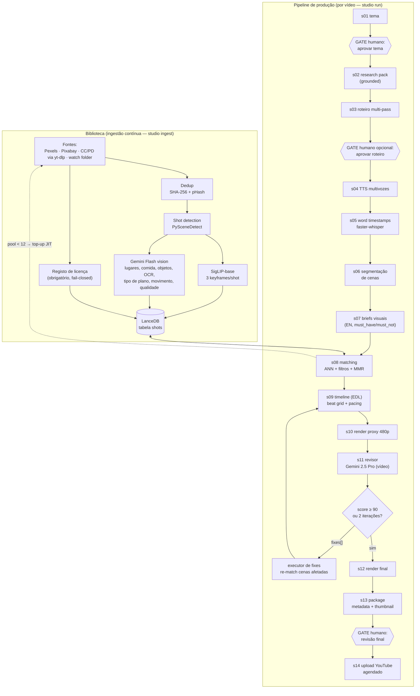
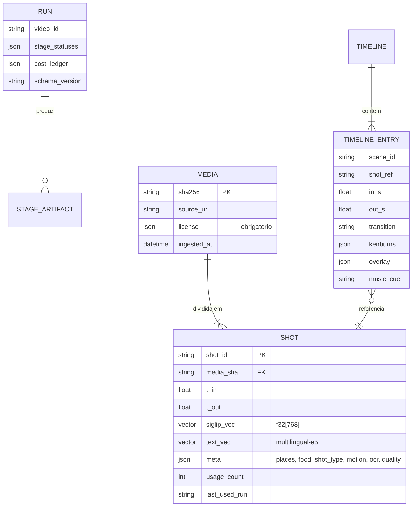
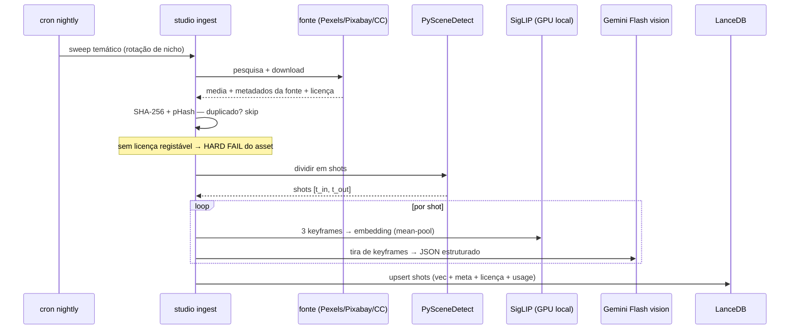

# ARCHITECTURE — Studio v2

**Versão:** 1.0 · **Data:** 2026-07-12 · **Estado:** Em aprovação
Decisões justificadas nos ADRs (`ADR/0001`–`0006`). Este documento descreve *o quê* e *como*; os ADRs descrevem *porquê*.

---

## 1. Visão geral do sistema

Dois subsistemas com ciclos de vida independentes, ligados por uma base vetorial:

1. **Biblioteca (contínua):** ingestão de footage → shot detection → embeddings visuais + metadados estruturados + licença → LanceDB. Corre à noite/semanalmente, independente de qualquer vídeo.
2. **Pipeline de produção (por vídeo):** DAG de 14 stages, de tema a upload, com checkpoints em disco, 2 gates humanos (Telegram) e 1 loop de revisão IA limitado.



## 2. Doutrina: fail-closed

Regra cultural nº 1, inversa do sistema antigo (`.catch(() => null)` generalizado):

- Um stage **ou termina com outputs válidos** (manifest Pydantic validado) **ou o run pára** com erro tipado.
- Degradação nunca é silenciosa: só existe via **política nomeada e explícita** declarada no stage (ex.: `AllowPartialCoverage(max_gap_s=8)`), registada no `run.json`.
- Toda a chamada paga a API grava request/response em `artifacts/<stage>/llm_calls/` (auditoria e replay).
- Breaker de orçamento: se o ledger do run exceder o limite, o run pára em vez de continuar a gastar.

## 3. Contrato de Stage

```python
class StageResult(BaseModel):
    status: Literal["done", "failed", "waiting_approval"]
    outputs: list[Path]          # todos têm de existir para "done"
    cost_usd: float = 0.0
    tokens: TokenUsage | None = None
    notes: str = ""

class Stage(Protocol):
    name: str                    # "08_matching" — prefixo numérico = ordem
    def run(self, ctx: RunContext) -> StageResult: ...
```

- **Comunicação entre stages: só ficheiros.** Um stage lê artefactos de stages anteriores do disco e escreve os seus num diretório próprio + `manifest.json` (com `schema_version`). Nada passa em memória entre stages → cada stage é re-executável e testável isoladamente com fixtures.
- **Idempotência:** o runner marca `done` apenas quando todos os `outputs` existem e o manifest valida. Re-executar um stage `done` é no-op, salvo `--force-from <stage>`.
- **Resume:** `studio resume <video_id>` lê `run.json`, salta stages `done`, retoma no primeiro `pending`/`failed`.
- **Loops limitados** (revisor→fix→re-render) são `for` loops dentro de um stage composto — nunca recursão nem grafo dinâmico.

## 4. Artifact store

```
data/                                  # gitignored, disco grande
  runs/<video_id>/
    run.json                           # estado do pipeline + cost ledger
    01_topic/       topic.json, research_pack.md
    02_script/      script.md, script_meta.json, critique_rounds/
    03_audio/       narration.wav, words.json, segments.json
    04_scenes/      scenes.json
    05_briefs/      briefs.json
    06_matching/    assignments.json, candidates_debug/
    07_timeline/    timeline.json      # EDL — contrato central
    08_render/      proxy_480p.mp4, segments_cache/, contact_sheets/, final.mp4
    09_review/      review_r1.json, fixes_r1.json, review_r2.json
    10_publish/     metadata.json, thumbnail.png, upload_receipt.json
  library/
    media/<sha256>.<ext>               # originais, content-addressed
    shots/<sha256>/<shot_id>/          # keyframes, proxies de shot
    lancedb/                           # base vetorial (diretório, backup trivial)
    ingest_log.jsonl
  music/                               # faixas licenciadas + beat grids (librosa)
```



## 5. Schemas centrais

### 5.1 `run.json`

```jsonc
{
  "schema_version": "1.0",
  "video_id": "2026-07-lisboa-gastronomia",
  "topic": "...",
  "created_at": "...",
  "stages": {
    "01_topic":   {"status": "done", "attempts": 1, "finished_at": "...", "cost_usd": 0.05},
    "08_matching":{"status": "failed", "attempts": 2, "error": "PoolExhausted(scene=s12)"},
    "11_review":  {"status": "pending"}
  },
  "gates": {"topic": "approved", "script": "skipped", "final": null},
  "cost_ledger": {"total_usd": 1.42, "by_stage": {"03_script": 0.81}, "budget_usd": 15.0},
  "policies": ["AllowPartialCoverage(max_gap_s=8)"]
}
```

### 5.2 `timeline.json` (EDL) — contrato central

Tudo a montante produz-o; tudo a jusante (render, revisor, fixes) consome-o. Alterações ao vídeo são **sempre** patches à timeline, nunca edições diretas de media.

```jsonc
{
  "schema_version": "1.0",
  "video_id": "...",
  "audio": {"narration": "03_audio/narration.wav", "music_track": "music/track_07.mp3"},
  "entries": [
    {
      "scene_id": "s03",
      "beat": "reveal",                      // hook|context|reveal|detail|transition|payoff|cta
      "narration": {"t_in": 41.2, "t_out": 47.9, "text": "..."},
      "shot_ref": "a1b2c3.../shot_004",
      "source": {"in_s": 2.1, "out_s": 8.8},
      "transition_in": {"type": "cut"},       // cut|xfade|dip_black|whip
      "kenburns": {"mode": "push_in", "zoom_max": 1.06, "easing": "ease_in_out"} ,
      "overlay": {"type": "lower_third", "text": "Time Out Market, Lisboa"},
      "music_cue": {"snap_to_beat": true, "beat_t": 41.18}
    }
  ]
}
```

### 5.3 Rubrica do revisor (output estruturado)

```jsonc
{
  "schema_version": "1.0",
  "per_scene": [
    {"scene_id": "s03", "visual_match": 9, "continuity": 8, "pacing": 9, "issues": []}
  ],
  "global": {"narrative_flow": 9, "repetition": 10, "audio_sync": 9, "overall": 92},
  "fixes": [
    {
      "scene_id": "s07",
      "action": "replace_shot",              // vocabulário fechado:
      "reason": "narração fala de pastel de nata; shot mostra fachada de igreja",
      "brief_override": {"visual_subject_en": "close-up pastel de nata custard tart", "must_not": ["monument", "church"]}
    }
  ]
}
```

Ações permitidas ao executor de fixes: `replace_shot | trim | reorder | change_transition | extend_broll`. Nada fora deste vocabulário é executado.

## 6. Biblioteca e ingestão



- **Unidade de retrieval = shot** (não ficheiro): multiplica pool utilizável 5–10×.
- **Metadados por shot:** `{places[], landmarks[], food_items[], objects[], ocr_text, shot_type, camera_motion, time_of_day, indoor_outdoor, people_present, quality_score 0-10, defects[]}`.
- **Top-up just-in-time:** se o pool de uma cena < 12 candidatos, o matcher dispara busca dirigida em Pexels/Pixabay → os resultados passam **pelo mesmo caminho de ingestão** e ficam na biblioteca para sempre. A biblioteca só cresce; a fome de pool é estruturalmente impossível após warm-up (seed ≥ 2.000 shots).

## 7. Matching (data-flow)

```mermaid
flowchart LR
    N["Cena\n(narração PT-BR\n+ beat + duração)"] --> B["Brief visual\nGemini Flash → EN\nmust_have / must_not"]
    B --> Q["Query ANN\nSigLIP text-tower (EN)\n+ filtros de metadados"]
    Q --> DB[("LanceDB")]
    DB --> C["top-40 candidatos"]
    C --> HF["Filtro DURO:\nmust_not × meta\n(monumento nunca entra\nem cena de comida)"]
    HF --> SC["Score:\n0.5·siglip_sim\n+ 0.25·regras metadados\n+ 0.25·sim narração\n(multilingual-e5)"]
    SC --> MMR["MMR λ≈0.7\n+ shot ≤1×/vídeo\n+ ficheiro ≤3×/vídeo\n+ cooldown entre vídeos"]
    MMR --> A["assignments.json"]
    A --> CG{"melhor score\n< threshold?"}
    CG -- "sim" --> TU["top-up JIT\n→ ingestão → re-match"]
    CG -- "não" --> TL["timeline.json"]
```



Porque isto mata a classe monumento/comida: (a) pool grande, (b) similaridade visual direta cross-modal em vez de texto-sobre-texto, (c) `must_not` é filtro simbólico duro sobre metadados estruturados, (d) a query é escrita por LLM a partir da narração, não por dicionário keyword.

**Nota PT-BR↔EN:** o text tower do SigLIP é English-centric. Briefs são gerados **sempre em inglês** por construção; a semântica PT-BR entra pelo rerank com multilingual-e5 sobre o resumo textual dos metadados do shot. Eval set de 30 pares query→shot corre em CI para detetar regressões de retrieval.

## 8. Ritmo e pós-produção

- **Pacing:** cada cena tem beat narrativo tipado; bandas de duração por beat (hook 1.8–2.8 s; detail/food 3–5 s; establishing 4–6 s; payoff ≤7 s). Curva de ASL (average shot length) por posição normalizada no capítulo: abre rápido, respira no meio, acelera antes do payoff. O timeline builder é um fitter de constraints, não um LLM.
- **Música:** faixas pré-analisadas na ingestão (librosa: BPM, beat grid, curva de energia, secções). Cortes snap ao beat mais próximo ±180 ms; mudanças de secção alinham com mudanças de beat narrativo.
- **Render:** FFmpeg puro via builder de filtergraph tipado (ADR-0004). Transições com disciplina: ~80% corte seco, xfade 0.3–0.5 s em mudança de capítulo, dip-to-black em quebras de ato, whip só no hook. Ken Burns dirigido por metadados (push-in em close-ups, drift lateral em paisagens, zoom máx 1.08×, desligado se o shot já tem movimento de câmara). LUTs de casa (warm-travel, food, dusk). Áudio: narração -16 LUFS, ducking por **sidechaincompress** keyed na narração, mix final loudnorm 2-pass -14 LUFS. Legendas ASS a partir dos word timestamps; chapter cards por drawtext.
- **Dois renders:** proxy 480p ultrafast (para o revisor) e final 1080p. Cache de segmentos keyed por hash da entrada da timeline → iterações de fix re-renderizam só segmentos alterados.

## 9. Revisor (loop limitado)

- **Input:** proxy 480p com scene-ID+timecode queimados no canto, via Gemini Files API + roteiro com fronteiras de cena + `timeline.json`. Custo ~$0.10–0.25/ronda (Gemini 2.5 Pro, vídeo em resolução de media baixa).
- **Output:** rubrica estruturada (§5.3).
- **Loop:** `overall ≥ 90` → render final. Senão: executor aplica `fixes[]` (replace_shot re-corre matching da cena com `brief_override` e o shot anterior excluído), re-render só dos segmentos afetados, re-review das cenas alteradas via **contact sheets** (grelhas de keyframes — evita re-upload do vídeo inteiro). **Máximo 2 iterações**; check de monotonicidade (score desce → reverter ronda e ir a humano). Depois, gate humano sempre, com o relatório anexado.

## 10. Routing de modelos e custo (~vídeo de 12 min)

| Tarefa | Modelo | Custo est. |
|---|---|---|
| Scoring de temas (semanal, amortizado) | Gemini 2.5 Flash | $0.05 |
| Research pack (grounded search) | Gemini 2.5 Flash | $0.10 |
| Outline + draft + critique | Gemini 2.5 Pro (3 passes) | $0.80 |
| Humanize | GPT-4o (família diferente, quebra monocultura) | $0.30 |
| TTS | multivozes (local) | $0 |
| Word timestamps | faster-whisper large-v3-turbo int8 (GPU 4 GB) | $0 |
| Segmentação de cenas | Flash | $0.05 |
| Briefs visuais (~45 cenas) | Flash | $0.10 |
| Embeddings/retrieval | SigLIP local + LanceDB | $0 |
| Metadados de biblioteca (amortizado ~200 shots/sem) | Flash vision | $0.40 |
| Revisor (≤3 rondas c/ contact sheets) | Gemini 2.5 Pro | $0.40–0.80 |
| Título/descrição/capítulos/tags | Flash | $0.03 |
| Thumbnail (frame real) | local | $0 |
| **Total** | | **≈ $2.20–2.70** |

Router central em `llm/router.py` (task→modelo), budget breaker em `llm/budget.py`. Folga até $15 permite subir humanize/briefs para Pro ou mais rondas de revisão se as métricas o pedirem. Os IDs de modelo vivem em config, não em código — modelos trocam sem release.

## 11. Aprovações humanas (Telegram)

Um bot, três gates, implementados como estado `waiting_approval` no runner:

1. **Tema** (obrigatório): shortlist semanal com scores, botões inline.
2. **Roteiro** (opcional, flag `--gate-script`; on por defeito nos primeiros ~10 vídeos).
3. **Final** (obrigatório): proxy + relatório do revisor + thumbnail + título; botões Aprovar / Notas de correção (texto livre → 1 ronda bónus de fix) / Rejeitar. Upload agendado só após aprovação.

## 12. Estrutura do código

```
studio/
  pyproject.toml            # uv; Python 3.12 pinado (sistema 3.14 → sem wheels torch)
  docs/                     # este pacote
  prompts/                  # PROMPTS VERSIONADOS EM FICHEIRO — nunca inline
    script/    outline.v1.md  draft.v1.md  critique.v1.md  humanize.v1.md
    vision/    shot_metadata.v1.md  visual_brief.v1.md
    review/    rough_cut_rubric.v1.md
    discovery/ topic_scoring.v1.md
  src/studio/
    cli.py                  # studio run|resume|ingest|approve|status
    config.py               # Pydantic Settings, um .env
    orchestrator/  runner.py  state.py  stage.py
    stages/        s01_topic.py … s14_upload.py     # finos; lógica nos módulos de domínio
    library/       ingest.py  shots.py  embed.py  metadata.py  db.py  search.py  licenses.py
                   sources/ pexels.py  pixabay.py  ytdlp_cc.py  watchfolder.py
    matching/      briefs.py  scorer.py  mmr.py  assigner.py  usage.py
    audio/         tts_client.py  whisper.py  music.py
    render/        timeline.py  filtergraph.py  transitions.py  kenburns.py  color.py  mix.py  captions.py  proxy.py
    review/        reviewer.py  rubric.py  fixes.py
    script/        research.py  outline.py  draft.py  critique.py  humanize.py  lint.py
    publish/       youtube.py  metadata.py  thumbnail.py  schedule.py
    discovery/     trends.py  competitors.py  scoring.py
    approvals/     telegram.py  gates.py
    llm/           router.py  gemini.py  openai.py  budget.py  cache.py
  tests/
    unit/          # scorer, mmr, filtergraph, matemática EDL — sem APIs
    integration/   # LanceDB roundtrip, multivozes, ffmpeg smoke
    fixtures/      # clips minúsculos, manifests golden, respostas LLM gravadas
    e2e/           # mini-run com biblioteca fixture
```

## 13. Fronteiras com o sistema antigo

- `pipeline/` (Node) permanece intocado e executável até ao cutover (critérios no `ROADMAP.md`).
- Partilham apenas: `multivozes_br_engine` (HTTP, porta 5050) e credenciais (`.env` → Pydantic Settings; mesmos OAuth tokens de YouTube).
- Media da biblioteca local antiga é **re-ingerida** pelo caminho novo (embeddings e metadados regenerados; o JSON antigo não é portado).
